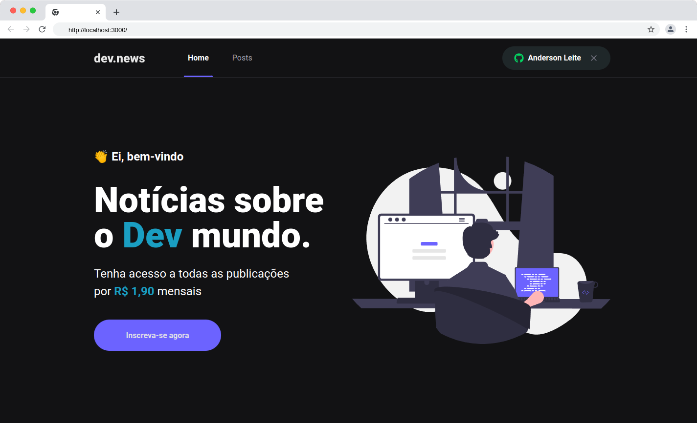
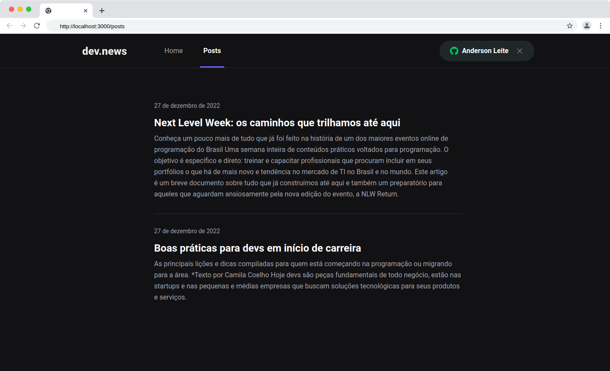
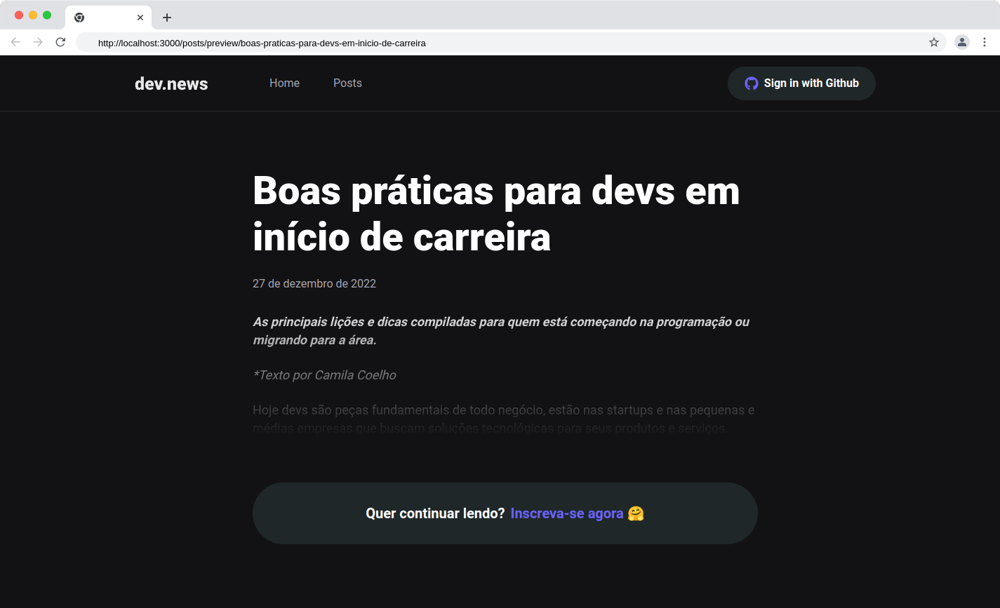
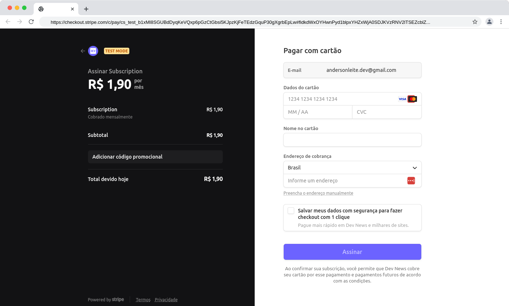
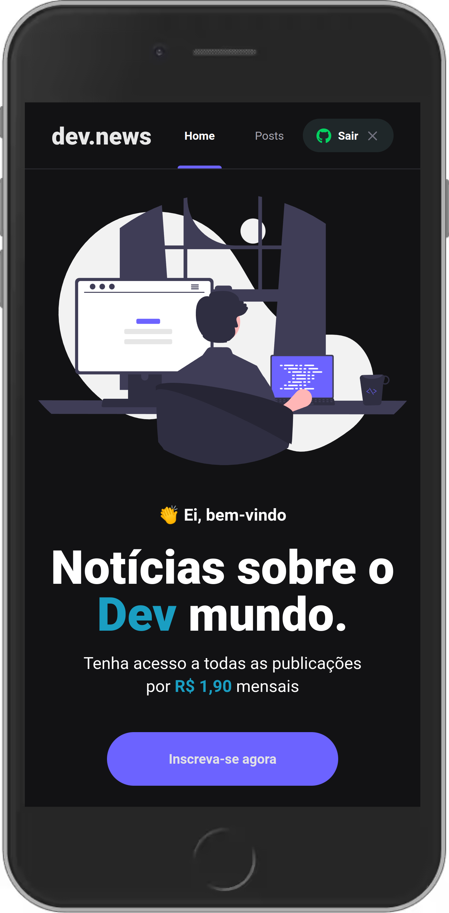
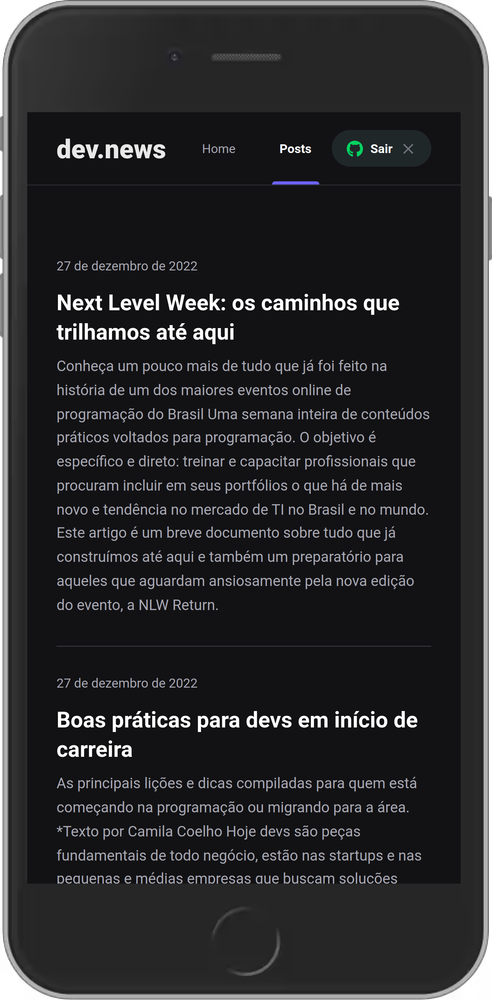
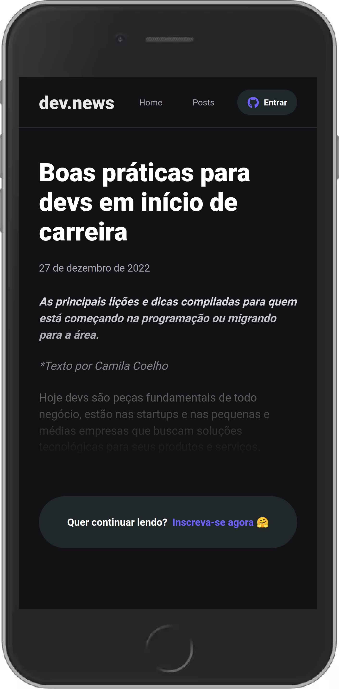
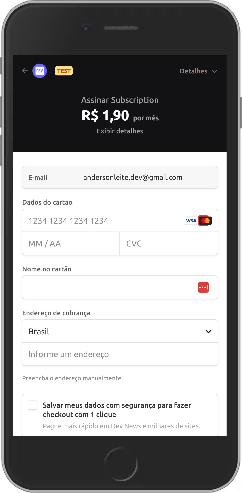

<h1 align="center">

 

</h1>

  <h3 align="center">DEVNEWS - Portal de notícias para Devs 👨‍💻</h3>
  <br>

  <p align="center">
    <a href="https://rocketseat.com.br">
      
    </a>
    <a href="https://www.linkedin.com/in/andersonleitedev/">
      
    </a>
  </p>

---

<p align="center">
  <a href="#dart-sobre">Sobre</a> &#xa0; | &#xa0; 
  <a href="#rocket-tecnologias">Tecnologias</a> &#xa0; | &#xa0;
  <a href="#white_check_mark-requerimentos">Requerimentos</a> &#xa0; | &#xa0;
  <a href="#checkered_flag-configurações-necessárias">Configurações necessárias</a> &#xa0; &#xa0; | &#xa0;
  <a href="#framed_picture-imagens">Imagens</a> &#xa0; &#xa0;
</p>

<br>

## :dart: Sobre ##

O projeto <strong>devnews</strong> é um blog onde os usuários podem acessar o conteúdo de cada postagem com base em seu status de assinatura.<br/>
O blog possui um sistema de compra integrado ao STRIPE e após o usuário efetuar o pagamento, sua assinatura estará ativa e pronta 
para visualizar o conteúdo completo de todo o blog. Caso o usuário não deseje participar, terá acesso limitado ao conteúdo das postagens. 
E todos os dados necessários para verificar assinaturas ou dados do usuário são armazenados no banco de dados FaunaDB.
<br>
<br>
Esta é uma aplicação sem servidor (Serverless), ou seja, todo o processo que dependeria do backend foi integrado ao frontend e de acordo com o padrão JAMStack.
<br>
Os postes são feitos com um painel Prismic CMS e integrados diretamente pelo frontend.

## :rocket: Tecnologias ##

As seguintes tecnologias foram utilizadas no projeto:

- [Next.js](https://nextjs.org/) | 13.0.3
- [NextAuth.js](https://next-auth.js.org/) | ^4.17.0
- [Prismic CMS](https://prismic.io/) | ^2.2.7
- [Stripe](https://stripe.com/) | ^11.1.0
- [FaunaDB](https://fauna.com/) | ^4.7.1
- [TypeScript](https://www.typescriptlang.org/) | 4.9.3
- [SASS](https://sass-lang.com/) | ^1.56.1
- [AXIOS](https://axios-http.com/) | ^1.2.1

## :white_check_mark: Configurações necessárias ##

<p>Necessário realizar as instalações:</p>

- Ter [Git](https://git-scm.com/) para clonar o projeto.
- Ter [NodeJS](https://nodejs.org/en/) para rodar o projeto em NextJS
- Ter [Yarn](https://yarnpkg.com/) para instalar as dependências
- Ter [Stripe CLI](https://stripe.com/docs/stripe-cli) para testar e gerenciar sua integração com a Stripe

<p>Criar conta e configurar os serviços externos:</p>

- [Stripe](https://stripe.com/)
- [FaunaDB](https://fauna.com/)
- [Prismic CMS](https://prismic.io/)

## :checkered_flag: Começando ##

#### Execute o comando git clone para realizar o clone do repositório

```bash
git clone https://github.com/andersonleite1/devnews
```

#### Entre na pasta do repositório clonado
```bash
cd devnews
```

#### Execute yarn para instalar as dependências
```bash
yarn
```


#### Na raiz do projeto crie uma copia do arquivo .env.local.example<br/>

```bash
cp .env.local.example .env.local
```
- Altere o nome da copia para .env.local<br/>
- Preencha as variáveis ambiente de acordo com as instruções

#### Execute stripe listen para ouvir eventos do webhook
```bash
stripe listen --forward-to localhost:3000/api/webhooks
```

#### Para iniciar a aplicação
```bash
yarn dev
```

## :test_tube: Dados de testes do Checkout

- Pagamento bem-sucedido: 4242 4242 4242 4242
- Falha no pagamento: 4000 0000 0000 9995
- Precisa de autenticação: 4000 0025 0000 3155

## :framed_picture: Imagens ##

### Desktop (screenshot):

| Home  | Lista de Posts | 
| --- | --- |
|  |  | 

| Post Preview | Checkout |
| --- | --- |
|  |  |

### Mobile (screenshot):

| Home | Lista de Posts | Post Preview | Checkout |
| --- | --- | --- | --- |
|  |  |  |  |


### Dê uma olhada como o projeto ficou! :eyes:

[devnews-andersonleite1.vercel.app/](https://devnews-andersonleite1.vercel.app/)

<p align="right">
  <a href="https://www.linkedin.com/in/andersonleitedev/">
    
  </a>
</p>

